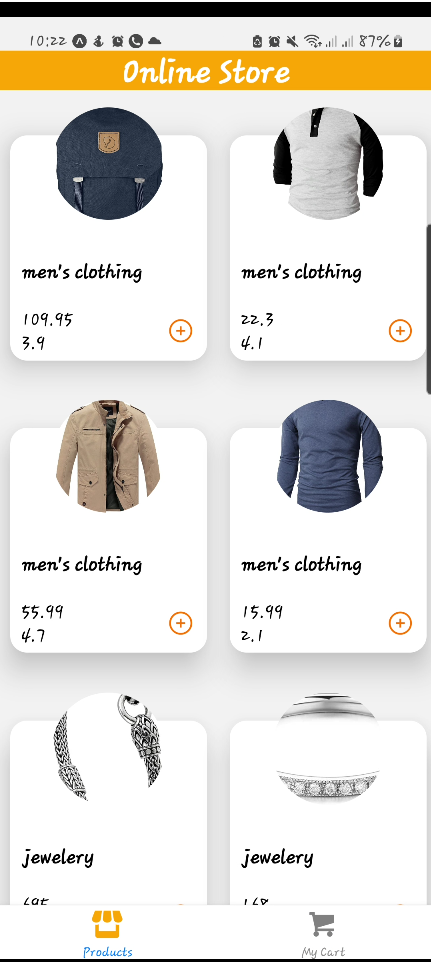
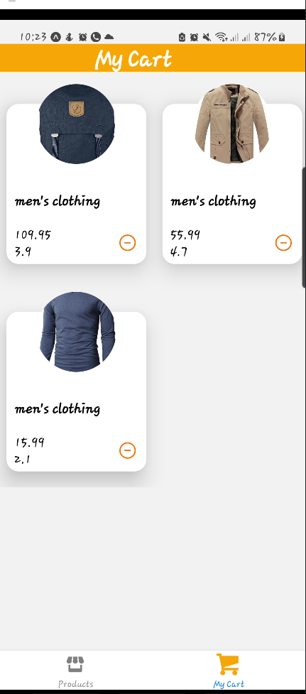

# OnlineSore_ReactNative
<h2>Features</h2>
<a href="https://youtu.be/rJ2AkVVQH2g">freatures video</a>

Online Store which get the product using API and give you the option to add and remove them to your cart

<h2>Technologies used in the React-Native App</h2>
<ul>
<li>Context</li>
<li>Redux</li>
<li>Async-Storage</li>
<li>Axios</li>
</ul>

